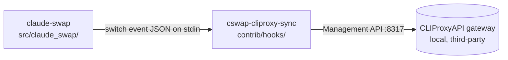

# claude-swap

Multi-account switcher for Claude Code. It swaps the active Claude account without a
logout, auto-switches before a rate limit, tracks per-account usage in a live dashboard,
and runs accounts in parallel, for both the Claude Code CLI and the VS Code extension.
This checkout is Milad's fork (`origin` `mimen/claude-swap`) tracking upstream
`realiti4/claude-swap`. The local directory is named `-menubar-prototype`, but the repo
is the whole upstream tool, not a menu-bar-only prototype. The menu bar is one optional
surface inside it.

## Components

Two. One published Python package and one standalone hook that the package invokes. They
share the repository and the switch-event contract, nothing else.

| Component | Path | What it is |
|---|---|---|
| `claude-swap` | `src/claude_swap/` | The published wheel (hatchling, PyPI, `0.27.0b1`). One entry point `cli:main`, exposed as `claude-swap` and `cswap`. The CLI, the Textual TUI (`--tui`), and the macOS menu bar (`--menubar`) are surfaces of this one package, not separate builds. |
| `post-switch hooks` | `contrib/hooks/` | Standalone executables `claude-swap` runs after a switch, wired through `hooks.postSwitch`. `cswap-cliproxy-sync` (555 lines) re-ranks a local CLIProxyAPI gateway's credentials. Not in the wheel, installed by hand. This is the fork's distinguishing content. |

The menu bar, TUI, and CLI are **surfaces of one package, not components**: one wheel, one
entry point, reached by flags, sharing the switcher engine and the same state files. The
directory name should not be read as a claim that the menu bar is a separate artifact.

`tests/` (~1900 tests) and `.github/` (CI plus the PyPI publish workflow) ship no runtime
code and are not components.

## How they relate

After every account switch the package spawns the configured `hooks.postSwitch`
executable, passing the switch event as JSON on stdin with
`CLAUDE_SWAP_POST_SWITCH_HOOK_ACTIVE=1` set. `cswap-cliproxy-sync` resolves the target
email against the gateway's credential list and rewrites priorities so the same account
wins on both sides. The hook holds no credential of its own and fails quietly if the
gateway, its management key, or a per-account login is missing.

## Is this live or abandoned

Live and depended on, despite the "prototype" in the directory name. Upstream has 546
commits since January 2026 with the newest here dated 2026-09-08, it is a published PyPI
package, and the local checkout is installed and exercised (`.venv/`, `.pytest_cache/`
present). The fork sits a couple of commits ahead of upstream, and that delta is exactly
the post-switch hook work, which is not upstreamed.

## Host constraints

The core CLI and TUI are cross-platform. `requires-python >=3.12` (the repo pins 3.14 via
`.python-version`), installed with `uv`, and CI proves the suite on Ubuntu, Windows, and
macOS. Any machine, headless included, can build, test, and run the switcher.

The menu bar is the constrained surface. It needs the optional `menubar` extra (`rumps`),
which is macOS only, and a GUI login (Aqua) session to draw a status item, so a headless
or Linux host cannot run it at all even though it can test the pure helpers, which are
import-safe by design. `launch_agent.py` installs a per-user LaunchAgent to keep the item
alive across login and reboot. `menubar.framework_build_warning` records a real ceiling:
on macOS 26 a framework build of Python stops drawing the status item (measured on
26.6.2, `rumps` 0.4.0), so the machine must be macOS with a suitable, non-framework
interpreter to exercise the menu bar for real.

## Repo-level gaps

No agent entry file at the root (no `AGENTS.md` or `CLAUDE.md`; only an untracked local
`.claude/`). No `DEPLOY.md`, though `.github/workflows/publish.yml` publishes to PyPI on a
GitHub release, so the deployment registry has no source here, and the fork does not
publish. The contrib hook's external prerequisites (a reachable CLIProxyAPI gateway, a
non-empty `remote-management.secret-key`, the on-disk key file, a gateway login per
account) all fail quietly when absent, which is documented but easy to miss on a new
machine.
